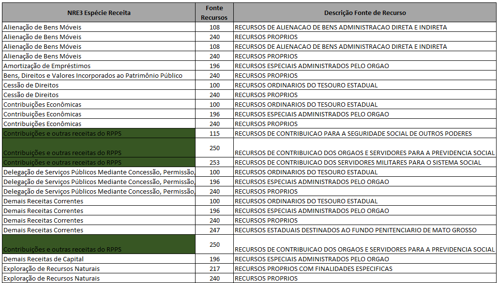

<!-- Global site tag (gtag.js) - Google Analytics -->
<script async src="https://www.googletagmanager.com/gtag/js?id=UA-147616071-2"></script>
<script>
  window.dataLayer = window.dataLayer || [];
  function gtag(){dataLayer.push(arguments);}
  gtag('js', new Date());

  gtag('config', 'UA-147616071-2');
</script>


```{r setup, include=FALSE}

# get local format

library(flexdashboard)
library(networkD3)
library(shiny)
library(readxl)
library(ggplot2)
library(openxlsx)# pacote para ler arquivo de excel
library(dplyr)
library(networkD3)
library(plotly)
library(viridis)
library(stringr)
library(readr)
library(Cairo)
library(ggrepel)
library(colorspace)
library(cluster)
library(tidyr)
library(stringr)
library(collapsibleTree)
library(knitr)
library(tidyverse)
library(flexdashboard)
library(leaflet)
library(lubridate)
library(DT)
library(gridExtra)
library(leafpop)
library(sf)
library(DataExplorer)
#novas libraries
library(purrr)


options(shiny.usecairo=T)

# ler os dados de exercução da despesa das LOA's e prevista de 2023.

dados <- read_excel("./dados/Despesa_funcao.xlsx", sheet = 3) 

dados <- dados[, c("Exercício","Descrição Função", "Descrição Subfunção", "Empenhado", "raiz")] 
names(dados)<- c("Ano","descricao_cofog_pai","descricao_cofog", "total_gasto", "raiz")

dados_completo <- dados %>% group_by(Ano, descricao_cofog_pai, descricao_cofog, 
                                 total_gasto, raiz)%>%
  summarize(total_gasto = sum(total_gasto))%>%filter(total_gasto > 0.00)
  
```


# Visão Geral


## Column  


#### **Introdução**

A Secretaria de Estado de Fazenda de Mato Grosso passa a publicar bimestralmente o Boletim Fiscal, em cumprimento à **Lei de Diretriz Orçamentária (LDO)**, com o objetivo de ampliar a transparência fiscal, avaliar o desempenho das receitas e dos gastos públicos e  fomentar as discussões acerca das finanças públicas.   

O documento traz dados e análises sobre informações pertinentes às conjunturas econômica e fiscal do estado, além do monitoramento dos indicadores e metas fiscais que auxiliam o gerenciamento das contas públicas estaduais.  

Tem sido cada vez mais comum encontrar informações e análises sobre as receitas e despesas do governo na imprensa, nos discursos de políticos e autoridades, e até nas conversas do dia-a-dia. Em geral, comparam-se receitas e despesas, fala-se em superávit ou déficit, analisa-se o crescimento das despesas, a sua composição etc. Mas como as receitas e as despesas orçamentárias da União de fato se relacionam?

Ou seja, o que pretendemos é responder, talvez de forma inédita, a seguinte pergunta: que receitas na prática financiam que despesas? Para isso, construímos uma visualização, agrupando as receitas e despesas em categorias, com o intuito de simplificar a extensa classificação orçamentária adotada no setor público brasileiro, e estimamos a relação entre cada uma dessas receitas e despesas. Os critérios técnicos adotados nesses agrupamentos estão descritos na seção de “Metodologia”, abaixo.

Esse tipo de visualização pode ajudar a iluminar algumas questões que surgem com frequência a respeito da gestão de finanças públicas no Governo Federal, por exemplo:

- É verdade que recursos dos tributos (impostos, contribuições e taxas) são gastos para pagar os juros da dívida?

- Se há um déficit no Regime Geral de Previdência Social, como ele é financiado?

- Se o governo vem apresentando déficit nas contas, de onde vem o dinheiro para pagar suas despesas?

- O que é feito com o dinheiro obtido pelo governo com a emissão e venda de títulos públicos, tais como os do Tesouro Direto?

**Como as receitas foram classificadas**          

Existem diversas formas possíveis de se agruparem as receitas orçamentárias. Para este exercício, procuramos destacar certos agrupamentos de receitas, tais como as emissões de títulos públicos, as receitas do INSS, as receitas de impostos etc. 

A classificação por natureza de receitas utiliza uma estrutura de codificação baseada num código numérico de 8 dígitos, em que as posições dos dígitos constituem classificadores intermediários, da seguinte forma:          

         


Para esta análise, as receitas foram agrupadas no seu terceiro nível, o nível de *Espécie*. Além disso, os recursos do Regime Geral de Previdência Social foram tratados de forma separada, por meio do classificador "unidade orçamentária".

Assim, as receitas foram agrupadas da seguinte forma:        

  


**Como as despesas foram classificadas**  

Para as despesas, foi adotada uma classificação baseada naquela utiliza no capítulo "Estrutura do Gasto Público no Brasil", de autoria de Mansueto Almeida, do livro "A Reforma Esquecida", acrescentando-se as despesas da dívida pública e as transferências a estados e municípios. Essa classificação estabelece um recorte das despesas públicas da seguinte forma:  


# Fluxo de Despesa {data-navmenu="Visualizações"}


Inputs {.sidebar}
------------------------------------------------------------------------
```{r}
# Série dos anos da base de dados "dados_completo"

ano <- unique(dados_completo$Ano)
```


```{r}
# Definindo o imput no shiny para filtrar o ano


selectInput("ano",label = h3("Selecione o Exercício:"),
            choices = ano, selected = max(ano) )


```


## Column 

### As despesas nas funções de Governo em milhão R$ 


```{r}
# Tratar os dados para criar o fluxogra da despesa estilo arvore

renderCollapsibleTree({

dados_tree = dados_completo[,c("Ano", "descricao_cofog_pai", 
                               "descricao_cofog", "raiz",
                               "total_gasto")] %>% filter(Ano == input$ano) %>%
  group_by(descricao_cofog_pai, descricao_cofog) %>%
  summarise(total = sum(total_gasto))

dados_tree%>%
  mutate(`Total gasto` = total /10^6) %>%
  collapsibleTreeSummary(
    hierarchy = c("descricao_cofog_pai", "descricao_cofog"),
    root = 'Gastos com funções de governo',
    width = 960,
    height = 720,
    attribute = "Total gasto",
    fontSize = 14,
    #nodeSize = "total_norm",
    zoomable = TRUE
  )

})


```


# Fluxo de Receita e Despesa LOA 2021 {data-navmenu="Visualizações"}
 
## Column {data-width=980}

### Valores em milhão R$


```{r}

rec <- read_excel("./dados/Receita.xlsx", sheet = 1, col_names = TRUE)
des <- read_excel("./dados/Despesa.xlsx", sheet = 1, col_names = TRUE)

names(rec) <- c("nr", "fte", "fte_nome", "rec")
names(des) <- c("fte", "fte_nome", "nd", "des")

rec <- rec %>%
  group_by(nr) %>%
  mutate(rec = rec,  #/1000000
         subtot_rec = sum(rec),
         per_rec_fte = rec/sum(rec)) # calcula os % de distrib. de cada rec nas ftes

des <- des %>%
  group_by(fte) %>%
  mutate(des = des, #/1000000
         per_fte_des = des/sum(des)) # calcula os % de distrib. de fte nas desps


# tenho uma lista de fontes

matriz <- rec %>%
  full_join(des, by = "fte") # pelo código da fonte, pq vai que o nome da fonte muda...

# calcula o % de dist. de cada rec nas desps
# calcula então o tamanho de cada link, partir do subtotal de cada receita. ignorando se for menor que um bilhao
### a fazer: remover as linhas com um anti_join, para não contaminar a informação do hoover (outgoing, ingoing count)

matriz <- matriz %>% 
  mutate(p = per_rec_fte * per_fte_des, 
         # ramo = ifelse((round(subtot_rec * p,0)<1000000000),0,round(subtot_rec * p,0))) %>%
         ramo = round(subtot_rec * p,0)) %>% 
  group_by(nr,nd) %>%                        
  summarise(p = sum(p),
            ramo = sum(ramo)) %>%
  select(nr,nd,p,ramo)

# limpeza

tamanho_critico <- 1e1 
ramos_a_limpar <- matriz %>% filter(ramo<tamanho_critico) #fazer no shiny

matriz_original <- matriz

matriz <- matriz %>%
  anti_join(ramos_a_limpar)

# relacao unica dos rotulos de receita e despesa:
rotulos <- c(unique(matriz$nr),unique(matriz$nd))

# conta os nós e gera sequencia numerica a partir de zero
num_nos <- length(rotulos)
nos <- 0:(num_nos-1)

# cria tabelinha para numerar os nos
tab_aux <- data.frame(rotulos, nos)

# incorpora os números dos nodes na matriz, para a receita... e para a despesa.
matriz <- matriz %>%
  left_join(tab_aux, by = c("nr" = "rotulos")) %>%   
  left_join(tab_aux, by = c("nd" = "rotulos"), suffix = c("_rec","_desp"))


# DEFINIÇÕES DAS CORES
library(RColorBrewer)

azul_STN <- "#1f476a"
cor_divida_transluc <- "rgba(186, 57, 23, 0.7)"
cor_RPPS_transluc <- "rgba(31, 71, 106, 0.7)"
cor_divida <- "#BA3917"
cor_RPPS <- azul_STN
cor_Pessoal <- "#01665E"

nclr = 9
#pclr <- brewer.pal(nclr, "Greens")#[5:9]# " tons de cores començando em 4 até 9"
cor_padrao_despesas <- c(brewer.pal(nclr, "Greens"))


qde_rec_destacadas <- 1
qde_cores_extras <- length(unique(matriz$nr)) - qde_rec_destacadas

paleta_STN <- brewer.pal(qde_cores_extras, "Set3")
#paleta_STN <- c("#F8AC08","#CEC806","#96C11E","#028063","#149339","#4E857E","#6E287C")

paleta_STN_rgb <- col2rgb(paleta_STN)

# essa função gera uma matriz com os componentes RGB.
# precisamos fornecer as cores no formato "rgb(r,g,b)"
# além disso, para os ramos, é interessante que as cores sejam translúcidas, 
# então vamos acrescentar um componente de transparência

paleta_STN_transluc <- NULL
for (i in 1:dim(paleta_STN_rgb)[2] ) {
  paleta_STN_transluc <- c(paleta_STN_transluc, paste("rgba(", paleta_STN_rgb[1,i],", ",  paleta_STN_rgb[2,i],", ",  paleta_STN_rgb[3,i],", 0.7)", sep = ""))
}

# rotininha para povoar as cores dos ramos e dos nos, conforme as receitas

receitas <- unique(matriz$nr)

cores_ramos <- NULL
cores_nos <- NULL
k = 1

for (i in 1:length(receitas)) {
  if (receitas[i] == "Contribuições e outras receitas do RPPS") {
    cores_ramos <- c(cores_ramos, cor_RPPS_transluc)
    cores_nos <- c(cores_nos, cor_RPPS)
  }
  else if (receitas[i] == "Contribuições Econômicas") {
    cores_ramos <- c(cores_ramos, cor_divida_transluc)
    cores_nos <- c(cores_nos, cor_divida)
  }
  else {
    cores_ramos <- c(cores_ramos, paleta_STN_transluc[k])
    cores_nos <- c(cores_nos, paleta_STN[k])
    k <- k + 1 # o certo seria fazer algo modular, caso sejam mais receitas que cores
  }
}

## povoando as cores das despesas... (com um método mais elegante do que um loop)
despesas <- unique(matriz$nd)
cores_despesas <- rep(cor_padrao_despesas, length(despesas))

cores_despesas[despesas == "Amortização da Dívida" | despesas == "Juros"] <- cor_divida

cores_despesas[despesas == "Benefícios Previdenciários RPPS e Assistência Social"] <- cor_RPPS

cores_despesas[despesas == "Pessoal"] <- cor_Pessoal

## fechando a lista de cores dos nos

cores_nos <- c(cores_nos, cores_despesas)

## tabelinha para usar de referência no preenchimento da matriz

tabelinha_cores_ramos <- data.frame(receitas, cores_ramos)

## preenchendo as cores dos ramos na matriz a partir dessa tabelinha

matriz <- matriz %>%
  left_join(tabelinha_cores_ramos, by = c("nr" = "receitas"))

## sem dívida

# qual o numero do no de juros
no_juros <- unique(matriz$nos_desp[which(matriz$nd=="Juros")])

# qual o numero do no de amortização da dívida
no_amort <- unique(matriz$nos_desp[which(matriz$nd=="Amortização da Dívida")])

matriz_semdivida <- matriz %>%
  mutate(nd = replace(nd, nd=="Juros", "Dívida"),
         nd = replace(nd, nd=="Amortização da Dívida", "Dívida"),
         nos_desp = replace(nos_desp, nd=="Dívida", min(no_juros,no_amort))) %>%
  #filter(!(nr == "Emissões de títulos" & nd == "Dívida")) %>% # atenção a esse filtro!
  group_by(nr,nd,nos_rec,nos_desp,cores_ramos)%>%
  summarize(p = sum(p),
            ramo = sum(ramo))

rotulos_divida <- c(unique(matriz_semdivida$nr),unique(matriz_semdivida$nd))


# DIAGRAMA

library(plotly)

# os textos do hover estão hardcoded no plotly. Então, em plotly-latest.min.js,
# que está na instalação do R, R\win-library\3.4\plotly\htmlwidgets\lib\plotlyjs,
# substituí "Incoming Flow Count", "Outgoing Flow Count", "Source:" e "Target:"
# pelas expressões que eu quis.


p <- function(dados,nomes){
  plot_ly(
    type = "sankey",
    orientation = "h",
    width = 820,
    height = 620,
    opacity = 0.6, 
    # será q isso controla a opacidade dos hovers? # nope, é hardcoded,
    #valueformat = ">-.3~g",
    #valuesuffix = " bilhões de reais",
    
    textfont = list(
      family = "Open Sans",
      color = "#444444",
      size = 12
    ),
    
    node = list(
      label = nomes,
      color = cores_nos,
      pad = 10,
      thickness = 25,
      line = list(
        color = "",
        width = 0
      )
    ),
    
    hoverlabel = list(
      font = list(
        family = "Open Sans"
      )
    ),
    
    link = list(
      source = dados$nos_rec,
      target = dados$nos_desp,
      value =  dados$ramo,
      color = dados$cores_ramos
      #color =  "rgba(255,213,0,0.4)" 
      # para deixar a cor translucida, é preciso usar rgba
      
    )
  ) %>% 
    layout(
      title = "",
      font = list(
        family = "Open Sans",
        size = 11,
        color = "#004a93"
      )
    )
}

# versão completa

p(matriz, rotulos)


```


## Column {.tabset }

### Tabela Despesa 
```{r}
despesa = matriz%>%
  group_by(nd)%>% 
  summarise(Total = sum(ramo)) %>% 
  mutate(perc_total = (Total/sum(Total))*100)

names(despesa)<- c("Despesa por Função","Total", "Part. %")

#renderTable({ d = despesa })
knitr::kable(despesa,  digits = 2, format.args = list( decimal.mark = ",", big.mark = ".")) 

```


### Tabela Receita
```{r}
receita = rec%>% group_by(nr)%>% 
  summarise(Receitas = sum(rec)) %>% 
  mutate(perc_total = (Receitas/sum(Receitas))*100)

names(receita)<- c("Receita por Espécie","Total", "Part. %")
#renderTable({ r = receita }) 

knitr::kable(receita, digits = 2, format.args = list( decimal.mark = ",", big.mark = ".")) 

 
```


# Fluxo de Receita e Despesa da LOA 2023 {data-navmenu="Visualizações"}

```{r}
library(readxl)
library(tidyverse)

rec_LOA <- read_excel("./dados/Receita.xlsx", sheet = 4, col_names = TRUE)

rec_LOA <- rec_LOA[,c("Especie", "FTE", "FTE_DESCRICAO", "LOA_2023")]

names(rec_LOA) <- c("nr", "fte", "fte_nome", "rec")

des_LOA <- read_excel("./dados/Despesa.xlsx", sheet = 2, col_names = TRUE)
des_LOA <- des_LOA[,c("FTE", "DESCRICAO_FTE", "agrupamento","Valor PTA")]
names(des_LOA) <- c("fte", "fte_nome", "nd", "des")

rec_LOA <- rec_LOA %>%
  group_by(nr) %>%
  mutate(rec = rec,  #/1000000
         subtot_rec = sum(rec),
         per_rec_fte = rec/sum(rec)) # calcula os % de distrib. de cada rec nas ftes

des_LOA <- des_LOA %>%
  group_by(fte) %>%
  mutate(des = des, #/1000000
         per_fte_des = des/sum(des)) # calcula os % de distrib. de fte nas desps


# tenho uma lista de fontes

matriz_LOA <- rec_LOA %>%
  full_join(des_LOA, by = "fte") # pelo código da fonte, pq vai que o nome da fonte muda...

# calcula o % de dist. de cada rec nas desps
# calcula então o tamanho de cada link, partir do subtotal de cada receita. ignorando se for menor que um bilhao
### a fazer: remover as linhas com um anti_join, para não contaminar a informação do hoover (outgoing, ingoing count)

matriz_LOA <- matriz_LOA %>% 
  mutate(p = per_rec_fte * per_fte_des, 
         # ramo = ifelse((round(subtot_rec * p,0)<1000000000),0,round(subtot_rec * p,0))) %>%
         ramo = round(subtot_rec * p,0)) %>% 
  group_by(nr,nd) %>%                        
  summarise(p = sum(p),
            ramo = sum(ramo)) %>%
  select(nr,nd,p,ramo)

# limpeza

tamanho_critico <- 1e1 
ramos_a_limpar <- matriz_LOA %>% filter(ramo<tamanho_critico) #fazer no shiny

matriz_original <- matriz_LOA

matriz_LOA <- matriz_LOA %>%
  anti_join(ramos_a_limpar)

# relacao unica dos rotulos de receita e despesa:
rotulos_LOA <- c(unique(matriz_LOA$nr),unique(matriz_LOA$nd))

# conta os nós e gera sequencia numerica a partir de zero
num_nos <- length(rotulos_LOA)
nos <- 0:(num_nos-1)

# cria tabelinha para numerar os nos
tab_aux_LOA <- data.frame(rotulos_LOA, nos)

# incorpora os números dos nodes na matriz, para a receita... e para a despesa.
matriz_LOA <- matriz_LOA %>%
  left_join(tab_aux_LOA, by = c("nr" = "rotulos_LOA")) %>%   
  left_join(tab_aux_LOA, by = c("nd" = "rotulos_LOA"), suffix = c("_rec","_desp"))


# DEFINIÇÕES DAS CORES
library(RColorBrewer)

azul_STN <- "#1f476a"
cor_divida_transluc <- "rgba(186, 57, 23, 0.7)"
cor_RPPS_transluc <- "rgba(31, 71, 106, 0.7)"
cor_divida <- "#BA3917"
cor_RPPS <- azul_STN
cor_Pessoal <- "#01665E"

nclr = 12
#pclr <- brewer.pal(nclr, "Greens")#[5:9]# " tons de cores començando em 4 até 9"
cor_padrao_despesas <- c(brewer.pal(nclr, "Paired"))


qde_rec_destacadas <- 1
qde_cores_extras <- length(unique(matriz_LOA$nr)) - qde_rec_destacadas

paleta_STN <- brewer.pal(qde_cores_extras, "Set3")
#paleta_STN <- c("#F8AC08","#CEC806","#96C11E","#028063","#149339","#4E857E","#6E287C")

paleta_STN_rgb <- col2rgb(paleta_STN)

# essa função gera uma matriz com os componentes RGB.
# precisamos fornecer as cores no formato "rgb(r,g,b)"
# além disso, para os ramos, é interessante que as cores sejam translúcidas, 
# então vamos acrescentar um componente de transparência

paleta_STN_transluc <- NULL
for (i in 1:dim(paleta_STN_rgb)[2] ) {
  paleta_STN_transluc <- c(paleta_STN_transluc, paste("rgba(", paleta_STN_rgb[1,i],", ",  paleta_STN_rgb[2,i],", ",  paleta_STN_rgb[3,i],", 0.7)", sep = ""))
}

# rotininha para povoar as cores dos ramos e dos nos, conforme as receitas

receitas_LOA <- unique(matriz_LOA$nr)

cores_ramos <- NULL
cores_nos <- NULL
k = 1

for (i in 1:length(receitas_LOA)) {
  if (receitas_LOA[i] == "Contribuições ao Plano Financeiro e Previdenciário do RPPS") {
    cores_ramos <- c(cores_ramos, cor_RPPS_transluc)
    cores_nos <- c(cores_nos, cor_RPPS)
  }
  else if (receitas_LOA[i] == "Contribuições Econômicas") {
    cores_ramos <- c(cores_ramos, cor_divida_transluc)
    cores_nos <- c(cores_nos, cor_divida)
  }
  else {
    cores_ramos <- c(cores_ramos, paleta_STN_transluc[k])
    cores_nos <- c(cores_nos, paleta_STN[k])
    k <- k + 1 # o certo seria fazer algo modular, caso sejam mais receitas que cores
  }
}

## povoando as cores das despesas... (com um método mais elegante do que um loop)
despesas_LOA <- unique(matriz_LOA$nd)
cores_despesas <- rep(cor_padrao_despesas, length(despesas_LOA))

cores_despesas[despesas_LOA == "Amortização da Dívida" | despesas_LOA == "Juros"] <- cor_divida

cores_despesas[despesas_LOA == "Previdência Social (RPPS)"] <- cor_RPPS

cores_despesas[despesas_LOA == "Pessoal e Encargos Sociais"] <- cor_Pessoal

## fechando a lista de cores dos nos

cores_nos <- c(cores_nos, cores_despesas)

## tabelinha para usar de referência no preenchimento da matriz

tabelinha_cores_ramos <- data.frame(receitas_LOA, cores_ramos)

## preenchendo as cores dos ramos na matriz a partir dessa tabelinha

matriz_LOA <- matriz_LOA %>%
  left_join(tabelinha_cores_ramos, by = c("nr" = "receitas_LOA"))

## sem dívida

# qual o numero do no de juros
no_juros <- unique(matriz_LOA$nos_desp[which(matriz_LOA$nd=="Juros")])

# qual o numero do no de amortização da dívida
no_amort <- unique(matriz_LOA$nos_desp[which(matriz_LOA$nd=="Amortização da Dívida")])

matriz_semdivida <- matriz_LOA %>%
  mutate(nd = replace(nd, nd=="Juros", "Dívida"),
         nd = replace(nd, nd=="Amortização da Dívida", "Dívida"),
         nos_desp = replace(nos_desp, nd=="Dívida", min(no_juros,no_amort))) %>%
  #filter(!(nr == "Emissões de títulos" & nd == "Dívida")) %>% # atenção a esse filtro!
  group_by(nr,nd,nos_rec,nos_desp,cores_ramos)%>%
  summarize(p = sum(p),
            ramo = sum(ramo))

rotulos_divida <- c(unique(matriz_semdivida$nr),unique(matriz_semdivida$nd))


# DIAGRAMA

library(plotly)

# os textos do hover estão hardcoded no plotly. Então, em plotly-latest.min.js,
# que está na instalação do R, R\win-library\3.4\plotly\htmlwidgets\lib\plotlyjs,
# substituí "Incoming Flow Count", "Outgoing Flow Count", "Source:" e "Target:"
# pelas expressões que eu quis.


f <- function(dados,nomes){
  plot_ly(
    type = "sankey",
    orientation = "h",
    width = 920,
    height = 720,
    opacity = 0.6, 
    # será q isso controla a opacidade dos hovers? # nope, é hardcoded,
    #valueformat = ">-.3~g",
    #valuesuffix = " bilhões de reais",
    
    textfont = list(
      family = "Open Sans",
      color = "#444444",
      size = 12
    ),
    
    node = list(
      label = nomes,
      color = cores_nos,
      pad = 10,
      thickness = 25,
      line = list(
        color = "",
        width = 0
      )
    ),
    
    hoverlabel = list(
      font = list(
        family = "Open Sans"
      )
    ),
    
    link = list(
      source = dados$nos_rec,
      target = dados$nos_desp,
      value =  c(dados$ramo,dados$p),
      color = dados$cores_ramos
      #color =  "rgba(255,213,0,0.4)" 
      # para deixar a cor translucida, é preciso usar rgba
      
    )
  ) %>% 
    layout(
      title = "",
      font = list(
        family = "Open Sans",
        size = 11,
        color = "#004a93"
      )
    )
}

# versão completa

f(matriz_LOA, rotulos_LOA)


# https://plotly-r.com/preface.html
# https://www.tesourotransparente.gov.br/historias/fluxo-de-receitas-e-despesas
# https://plotly.com/python/sankey-diagram/

# https://github.com/plotly/plotly.js/blob/d971001a04273334d858930957fa86ebb0952e71/lib/locales/pt-br.js
# https://stackoverflow.com/questions/72957392/edit-boxplot-tooltip-text-plotly


```


# Visão da LOA 2023 {data-navmenu="Visualizações"}

Inputs {.sidebar}
------------------------------------------------------------------------
```{r}
dados_LOA <- read_excel("./dados/Despesa.xlsx", sheet = 2)
programa <- unique(dados_LOA$`Prog. Governo`)
#head(dados_LOA)
```


```{r}
# shiny inputs defined here

selectInput("programa",label = h3("Selecione o Programa:"),
            choices = programa, selected = programa[[1]] )

```

## Column 


### Fontes de Financiamento e Programas


```{r}
dados_LOA <- dados_LOA[, c("DESCRICAO_RECURSO",  "Prog. Governo","Ação (PAOE)","Cat.Econ","DESCRICAO_GRUPO","Valor PTA","raiz")] 
names(dados_LOA)<- c("descricao_pai","descricao_filho", "descricao_filha","descricao_neto", "descricao_bisneto","total_teto", "raiz")

```


<<<<<<< HEAD

### Chart A
=======
>>>>>>> a910a77... terceira alteração

```{r}
library(collapsibleTree)

renderCollapsibleTree({
  
dados_LOA = dados_LOA[,c("descricao_pai","descricao_filho", "descricao_filha","descricao_neto", "descricao_bisneto","total_teto", "raiz")] %>% 
  group_by(descricao_pai, descricao_filho, descricao_filha,descricao_neto, descricao_bisneto) %>%
  summarise(total = sum(total_teto))

dados_LOA%>% filter(descricao_filho == input$programa) %>%
  mutate(`LOA-2023` = total /10^6) %>%
  collapsibleTreeSummary(
    hierarchy = c("descricao_pai", "descricao_filha", "descricao_bisneto"),
    root = paste0('Orçamento LOA 2023'),
    width = 1280,# LARGURA
    height = 1280,# ALTURA
    attribute = "LOA-2023",
    fontSize = 12,
    tooltip = TRUE,
    fillFun = colorspace::heat_hcl, 
    maxPercent = 50,
    #nodeSize = "total_norm",
    zoomable = TRUE
  )

})

```


# Visão Grupo LOA 2023 {data-navmenu="Visualizações"}

## Column 

### Despesa por Grupo

```{r}

dados_grupo <- read_excel("./dados/Despesa.xlsx", sheet = 4)

dados_grupo <- dados_grupo[, c("DESCRICAO_RECURSO", "Grupo_DESCRICAO", "Teto","raiz")] 
names(dados_grupo)<- c("descricao_pai","descricao_filho", "total_teto", "raiz")


#names(dados_tree)<- c("Ano","descricao_cofog_pai","descricao_cofog", "total_gasto", "raiz")


library(collapsibleTree)

dados_grupo = dados_grupo[,c("descricao_pai","descricao_filho", "total_teto", "raiz")] %>% 
  group_by(descricao_pai, descricao_filho) %>%
  summarise(total = sum(total_teto))

dados_grupo%>%
  mutate(`Teto Orçamentário` = total /10^6) %>%
  collapsibleTreeSummary(
    hierarchy = c("descricao_pai", "descricao_filho"),
    root = paste0('Destinação dos Recursos no PLOA 2023'),
    width = 1280,# LARGURA
    height = 1280,# ALTURA
    attribute = "Teto Orçamentário",
    fontSize = 16,
    tooltip = TRUE,
    fillFun = colorspace::heat_hcl, 
    maxPercent = 50,
    #nodeSize = "total_norm",
    zoomable = TRUE
  )

```


# Mapas


## Column 
### **Mapa do Investimento nas Regiões**

```{r}


mt_regiao <- read_sf('./shape/Regiões_de_planejamento.shp')
dados_mt<- read.xlsx("./dados/Despesa.xlsx", sheet="Região II")
names(dados_mt) <- c("regiao",	"sigla_regiao",	"NUMERO")

regiao_mt <- mt_regiao %>% merge(dados_mt, by="NUMERO")
dados_mt <- dados_mt %>% merge(mt_regiao, by="NUMERO")

dados_loa<- read.xlsx("./dados/Despesa.xlsx", sheet=2)

dados_loa <- dados_loa[,c("regiao","DESCRICAO_RECURSO","COD_GRUPO","Valor.PTA")] 

names(dados_loa) <- c("regiao","DESCRICAO_RECURSO","COD_GRUPO","valor_pta") 

dados_loa <- dados_loa%>% filter(regiao != '9900-ESTADO' & COD_GRUPO == 4) %>% 
  group_by(regiao) %>%
  summarise(total = sum(valor_pta))

#quantile(dados_loa$total)
# Setting population density classes
dados_loa$FAIXA <- cut(dados_loa$total,breaks=c(0,
                                        67430590,
                                        116577921,
                                        163067805,
                                        176433032,
                                        184134736,
                                        204176118,
                                        211349595,
                                        214097205,
                                        216426238,
                                        254513840,
                                        390743797,
                                        1564176683), 
                       labels=c("67,4 milhões", 
                                "116,5 milhões", 
                                "163 milhões", 
                                "176,4 milhões", 
                                "184,1 milhões", 
                                "204,176 milhões", 
                                "211,2 milhões", 
                                "214 milhões", 
                                "216,4 milhões", 
                                "254,5 milhões", 
                                "390,7 milhões", 
                                "1,56 bilhão"))


mt_mun<- dados_loa  %>% merge(dados_mt, by = "regiao")


pclr = c("#1B9E77", "#D95F02", "#7570B3","#A50F15", "#67000D", "#66A61E","#9ECAE1", "#4292C6", "#08519C", "#08306B", "#2171B5", "#08306B")


# dfinir os nomes das microrregições 
points <- cbind(mt_mun, st_coordinates(st_centroid(mt_mun$geometry)))


renderPlotly({
  

  
  # Plotting
ggplot(data=mt_mun, aes(geometry = geometry))+
    # definir faixas e divisão administrativa dos municípios
    geom_sf(aes(fill=factor(FAIXA)),color=alpha("grey",0.4),data=mt_mun)+
    labs(x = NULL, y=NULL, fill= 'Faixa Investimento')+
    # faixa das regiões
    geom_sf(fill='transparent',color='black',data=mt_mun)+
    # nomes das municípios
    geom_text(data= points,aes(x=X, y=Y, label=NOMEREGIAO),
              color = "Black", fontface = "bold", check_overlap = FALSE, size = 1.9)+
    
    # escala munual das cores  
    #scale_fill_manual(values = pclr) +
    # formação do título e das legendas
    ggtitle(" ", 
            subtitle = ' ')+
    labs(caption=c('Fonte: SEFAZ, 2023'))+
    # retira o sistema cartesiano: tipo de layout do mapa padrão
    theme(panel.grid = element_line(colour = "transparent"),
          panel.background = element_blank(),
          axis.text = element_blank(),
          axis.ticks = element_blank())
  
})
```

# Dados Investimentos

```{r}
dados_loa<- read.xlsx("./dados/Despesa.xlsx", sheet=2)

dados_loa <- dados_loa[,c("U.O","regiao","DESCRICAO_RECURSO","COD_GRUPO","Valor.PTA")] 

names(dados_loa) <- c("UO","Regiao","Fonte","Grupo","Valor") 


```

## Column
### **Unidade Orçamentária e Fonte de Recurso**

```{r}
dados_UO <- dados_loa%>% filter(Grupo == 4) %>% 
  group_by(UO, Fonte) %>%
  summarise(Total = sum(Valor)) 

library(DT)
datatable(dados_UO,
  extensions = 'Buttons',
  selection = 'single', ## enable selection of a single row
  filter = 'bottom',              ## include column filters at the bottom
  rownames = FALSE                ## don't show row numbers/names
)%>% formatRound('Total', mark = ".",dec.mark = ",",digits = 2)

```


## Column
### **Dados por Região de Planejamento**


```{r}
dados_regiao <- dados_loa%>% filter(Grupo == 4) %>% 
  group_by(Regiao) %>%
  summarise(Total = sum(Valor)) %>% 
  mutate(perc_TOTAL = (Total/sum(Total))*100) 

names(dados_regiao) = c("Região", "Total", "Part. %")

library(DT)
datatable(dados_regiao,

  extensions = 'Buttons',
  selection = 'single', ## enable selection of a single row
  filter = 'bottom',              ## include column filters at the bottom
  rownames = FALSE  ,              ## don't show row numbers/names
  
  
) %>% formatRound(c('Total', 'Part. %'), mark = ".",dec.mark = ",",digits = 2)

```

